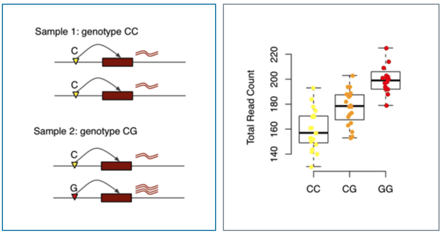

```{r setup, include=FALSE}
knitr::opts_chunk$set(echo = TRUE)
```

## Introduction

This is my report on my BIOS 611 data science project to analyze expression quantitative trait loci (eQTL) data generated from The Genotype-Tissue Expression Project (GTEx).

eQTL analysis finds statistical associations between genetic variants within a population and expression of a particular gene. Genetic variants near genes are systematically tested for association with a gene by pairing expression levels with the alleles at a given site of genetic variation. 

{height=50%}

In the left panel of Fig.1 is a cartoon example from Sun & Hu of how eQTL analysis is quantified in individual samples. eQTL analysis relies on quantifying data in a population of samples to perform a linear regression to establish associations between a genetic variation site and expression of a given gene. On the right panel, each dot represents an individual, with their given genotype and gene expression.

GTEx is one consortia that has quantified eQTLs in over 40 different tissues from almost 1000 donors. While these samples were collected post-mortem, the data provide a valuable resource for biologists and geneticists to understand genetic contributions to traits. Furthermore, from their efforts we now have a resource to characterize eQTL in the human body. For example, we have learned that eQTLs may have commonalities or differences across tissues such as their presence/absence and effect size since gene expression can also be specific to a given tissue.

For this project, I was interested to see if I could find patterns within this data across tissues, either from the variant or the gene perspective.

While my project has mostly been an exploratory analysis, it is by no means supposed to be an official report, but more of a casual walk-through of my project, my questions and thought processes along the way, and my findings.

## Background, or a place to start

In its most basic form, eQTL analysis assumes linear genomic space. This suggests that there will exist some underlying relationship between the components that make up an eQTL, the variants and genes. We can quantify the density of significant eQTL based on the distance between its variant and gene transcription start site (TSS).

{height=50%}

We can see from the plot in Fig.2 that the majority of eQTL variants are located close to genes they form eQTL with. This is actually a known phenomena, but let's see what else we can tease out of it. 

For example, we have so far only looked at eQTL that have been deemed "statistically significant". Does this pattern hold true for when we consider all eQTL? Or more colloquially, is the significance of an eQTL based on the distance between a variant and a gene in general? Furthermore, since we use linear regression to determine eQTL, does the distance between a variant and gene impact the effect size or the slope of the eQTL?

Let's take a look.

## Genomic Distance Metrics on eQTL Statistics

To visually determine whether eQTL significance is influenced by the distance between a variant and a gene, let's plot all eQTL reported by GTEx.

{height=50%}

We can see that from Fig.3, generally, this pattern still holds true. Although there are some number of eQTL with very high significance which contain variants that are 0.5-1Mb away from their associated gene TSS.

Let's also look at the eQTL effect size based on gene distance for significant eQTL. 

{height=49%}

Interestingly, Fig.4 suggests that there seems to be absolutely no relationship between the distance between a variant and its associated gene, and the effect size of an eQTL. However, the effect size of an eQTL is also influenced by the expression of the gene in question. This suggests that distance between a variant and gene alone is not enough to explain the complex relationship of genetic regulation. 
\newpage

## Genomic Density Metrics on eQTL Statistics

Let's take things a bit further, but in a different direction. 

For standard eQTL analysis, all tested variants are weighted equally. However, we know that genes are not distributed evenly across the genome, nor often are the variants that we test for associations. Let's look at the distribution of the genes and variants tested by GTEx.

{height=50%}

{height=50%}

In Fig.5, we can see that the distribution of genes across chromosomes varies. From Fig.6, we can also see that there is a similar distribution of variants tested across the chromosomes in this data set. 

This begs the question, if a variant is located in a gene dense region of the genome, is it more likely to form eQTLs with local genes compared to a variant located in a gene-sparse region? If so, we may want to reconsider how we weigh variants when we test for associations. Let us investigate.

For most local eQTL analysis, associations are tested between a given gene and all variants within a defined window around the beginning of a gene. This method assumes that 1) variants close to a gene are more likely to affect it, 2) genomic space is linear, and 3) there is a cause-effect relationship in which a variant controls the expression of a gene. While we have briefly looked at the first two assumptions, the third can allow us to potentially ask some interesting questions if we assume a variant plays a causal role. 

For example, it may be interesting to flip the eQTL model dynamic and instead, look at given a variant's position, how many genes does it have the potential to affect? And how many does it actually (based on eQTL statistics)?

So what I did was take my eQTL data set and try to flip it on its head. I took the primary eQTL variants across all tissue types (830,649 variants) and defined a 1 Mb window around each variant to figure out how many possible genes (out of roughly 40,000 genes across the genome) each variant would be tested with.

{height=50%}

From Fig.7, we can see that most variants have a fair number of genes that fall within their window. The red line denotes the median number of genes within a variant window, which is 36. Furthermore, there is actually a sizable number of variants that have even more than 100 genes within their window. 

However, when we look at how many eQTL are formed by each primary eQTL variant, the data is slightly underwhelming. 
\newpage

{height=50%}

The histogram in Fig.8 tells us that primary eQTL variants are mostly associated with only 1 gene and not multiple genes.

And so from these results, we can make a pretty decent guess that the proportion of significant eQTL to possible eQTL for a given variant is pretty small. 

However, we are only looking primary eQTL variants, or the top signals. You can imagine that genes can form eQTL with multiple variants. What if we look at all significant gene-variant pairs?
\newpage

{height=50%}

Again, many variants are only associated with one gene by eQTL analysis. However, we do see an increase in the number of hits per variant. You can see from Fig.9 that there is even at least one variant that is associated with 60 genes across all tissues!

{height=50%}

In addition, the proportional results in Fig.10 are also a bit more interesting. Now we begin to see a decent amount of variants who have a measurable proportion of significant eQTL. These results may suggest that some variants are enriched in large-scale eQTL analyses and may play important biological roles on a more systemic- or organismal-level than if we just consider one tissue alone. 
\newpage

As you can imagine, variants with a proportion of 1 were generally variants found within gene-sparse regions. But just to highlight another point of interest, I created a table sorting my variant data by the number of significant eQTL. 


What's really interesting about this table is that not only is the proportion of significant eQTL high, but remembering the distribution from Fig. 7 puts these variants at the right tail of that distribution. The variants in Table 1 are also found on chromosome 6, which is also known to harbor many genes, mostly associated with the Major Histocompatibility Complex.

## eQTL Variant Enrichment

I also wanted to take a deeper dive into some of these variants that are associated with multiple genes across tissues to try to extrapolate anything potentially interesting. To make things more manageable, I focused on variant chr19_21570287_A_C, which based on my analysis was associated with 14 significant primary eQTL out of a possible 70.


Using BioMart, I was able to pull up some information of the genes forming eQTL with chr19_21570287_A_C. From Table 3 you can see that there is a mix of protein-coding and non-coding genes. The protein-coding genes are for zinc finger proteins which are involved with a diverse set of biological functions that are generally integral to cellular function. Non-coding genes often play more of a regulatory role within a cell, and thus genetic control of non-coding genes can have downstream consequences for their protein-coding targets.


\newpage

## Summary and Conclusions

In summary, I have shown that our assumptions about genomic space may have implications for analyzing and interpreting traditional eQTL data sets. Certainly, from a biological perspective it makes sense that variants in proximity to genes, often within promoter regions, are more likely to have effects on said gene. However, this does not determine the actual effect size of the variant. 

I have also shown that genes and variants are not distributed evenly across the genome, even though they are tested as such. While my results are inconclusive, I believe it warrants further investigation whether gene density may play a role in statistical observations of eQTL analyses. This is further supported by the fact that variants associated with more eQTL/genes are generally located within denser regions of the genome. 

## Future Directions

To take this project a bit further, I think it would be interesting to look at these eQTL dynamics also taking into account the tissue perspective. For example, the variant chr19_21570287_A_C is statistically associated with 14 genes. While I did some preliminary digging that these genes are expressed in 22 tissues (over 40% of tissues analyzed), I did not look into specifics such as how many of these 22 tissues express each of the 14 genes? Is there any overlap in tissue similarity that would point to function? Are the effect sizes similar and/or in the same direction? 

## References
1. Sun, W., & Hu, Y. (2013). eQTL Mapping Using RNA-seq Data. Statistics in biosciences, 5(1), 198–219. https://doi.org/10.1007/s12561-012-9068-3
2. GTEx Consortium (2020). The GTEx Consortium atlas of genetic regulatory effects across human tissues. Science (New York, N.Y.), 369(6509), 1318–1330. https://doi.org/10.1126/science.aaz1776

